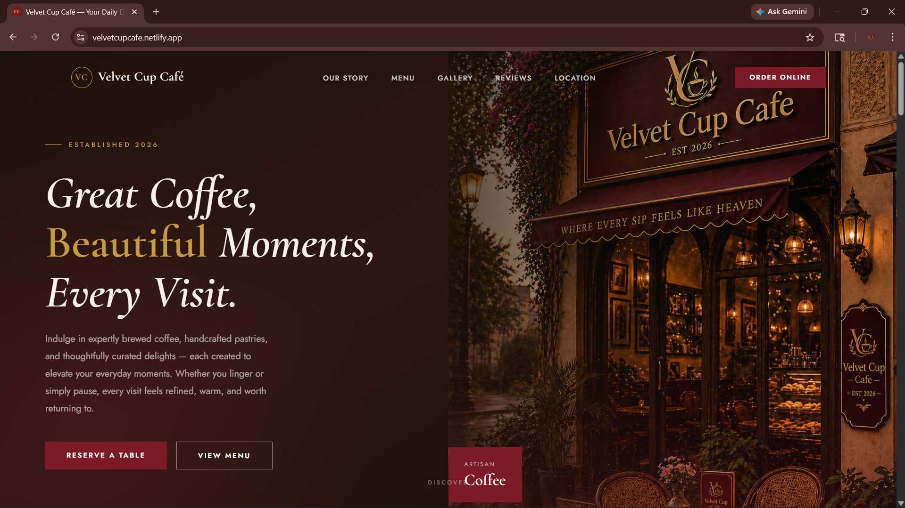
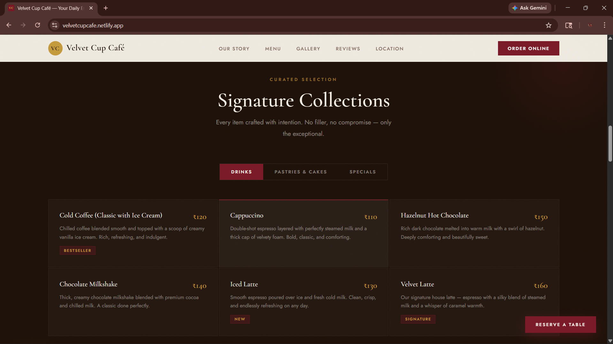
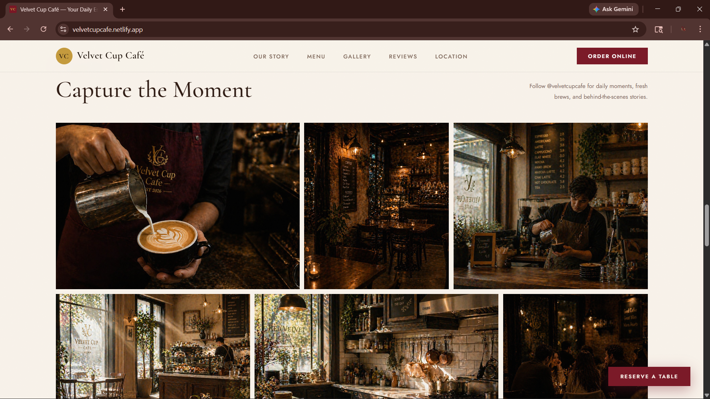
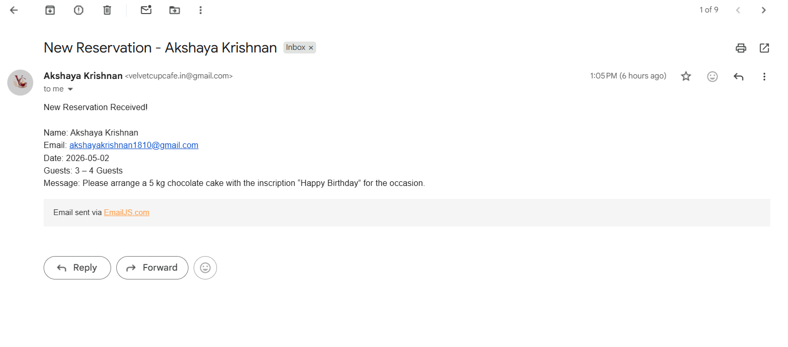
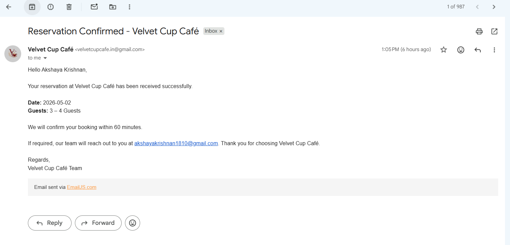
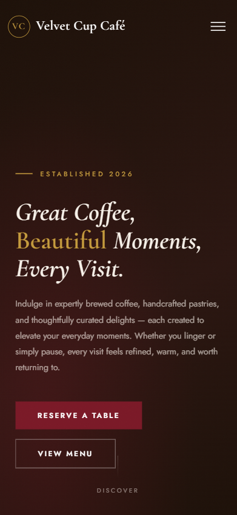

# Full Stack Web Development Internship

## Task 3 – Local Business Website & Live Pitch Project

# Velvet Cup Café — Business Website

---

## Overview

A responsive, client-focused website built for a local café as part of a real-world development task. The project is designed to improve the café’s online presence, present its offerings clearly, and enhance customer engagement.

---

## Objective

To design and develop a professional website that helps a local business:

* Improve online visibility
* Provide clear and accessible information
* Build trust with customers
* Increase walk-ins and engagement

---

## Problem

Many local cafés rely only on social media or offline presence, leading to:

* No centralized platform for information
* Difficulty accessing menu, location, and contact details
* Lower credibility compared to businesses with websites

---

## Solution

This website acts as a digital storefront by:

* Presenting menu and services in a structured format
* Showcasing ambience through a visual gallery
* Providing easy access to contact and location
* Enabling direct communication through a reservation/contact system

---

## Tech Stack

* HTML5
* CSS3
* JavaScript
* EmailJS

---

## Features

* Fully responsive design (mobile-first)
* Clean and modern UI (velvet red and beige theme)
* Structured menu section
* Gallery for ambience and visual appeal
* Testimonials for trust building
* Reservation/contact form with EmailJS integration
* Email notifications to both admin and customer

---

## Reservation Feature

Users can reserve tables by selecting date and guest count, along with optional special requests such as celebrations, cake arrangements, and seating preferences.

The system:

* Validates user input
* Prevents invalid submissions
* Sends confirmation emails to both the customer and café owner using EmailJS

---

## Sections

* Hero
* About
* Menu
* Gallery
* Testimonials
* Contact / Reservation

---

## Live

https://future-fs-03-sigma-murex.vercel.app/
https://velvetcupcafe.netlify.app/

---

## Repository

https://github.com/AkshayaKrishnan18/FUTURE_FS_03

---

## Preview

  

---

## Setup

Clone the repository and open `index.html` in a browser.

---

## Key Learning

* Building for real-world business scenarios
* Understanding customer needs and expectations
* Designing with business impact in mind
* Implementing third-party services like EmailJS

---

## Contact

* Email: [akshayakrishnan1810@gmail.com](mailto:akshayakrishnan1810@gmail.com)
* GitHub: https://github.com/AkshayaKrishnan18
* LinkedIn: https://linkedin.com/in/akshaya-krishnan-98722b294
