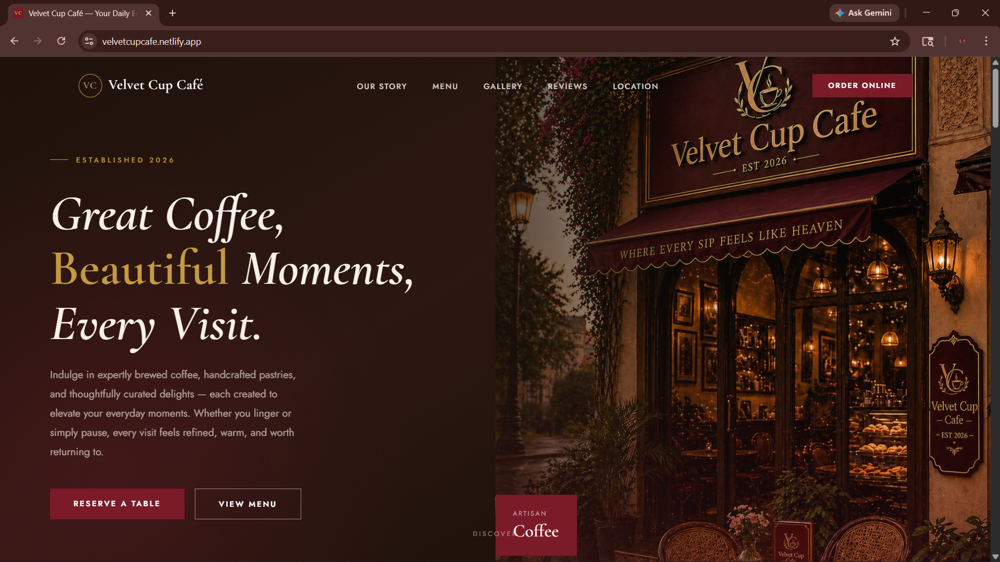
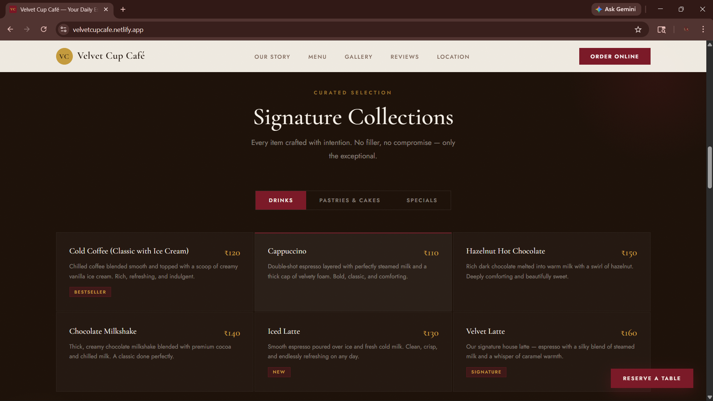
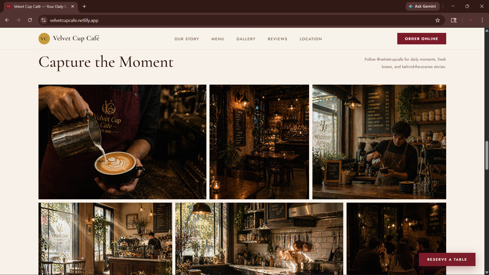
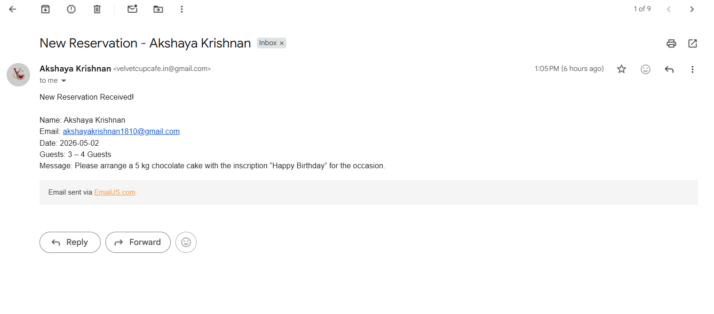
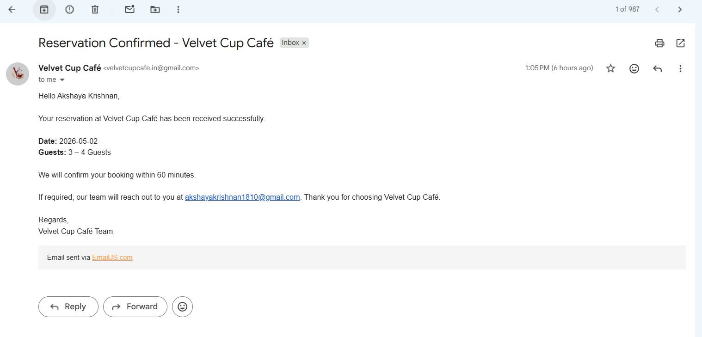
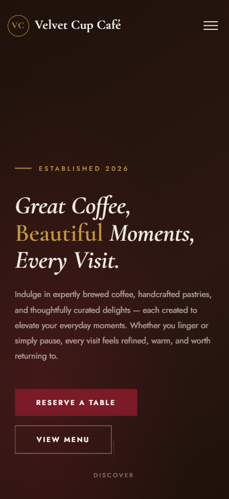

# Full Stack Web Development Internship

## Task 3 – Local Business Website & Live Pitch Project

# Velvet Cup Café — Business Website

---

## Overview

A responsive, client-focused website built for a local café as part of a real-world development task. The project is designed to improve the café’s online presence, present its offerings clearly, and enhance customer engagement.

---

## Objective

To design and develop a professional website that helps a local business:

* Improve online visibility
* Provide clear and accessible information
* Build trust with customers
* Increase walk-ins and customer engagement

---

## Problem

Many local cafés rely only on social media or offline presence, leading to:

* No centralized platform for information
* Difficulty accessing menu, location, and contact details
* Lower credibility compared to businesses with websites

---

## Solution

This website acts as a digital storefront by:

* Presenting menu and services in a structured format
* Showcasing ambience through a visual gallery
* Providing easy access to contact and location
* Enabling direct communication through a reservation system

---

## Tech Stack

* HTML5
* CSS3
* JavaScript
* EmailJS

---

## Features

* Fully responsive design (mobile-first)
* Clean and modern UI with a velvet red and beige theme
* Structured menu section
* Interactive gallery showcasing the café ambience
* Customer testimonials section
* Google Maps integration for location access
* Reservation form with EmailJS integration
* Automatic email notifications for both café owner and customer

---

## Reservation Feature

Users can reserve tables by selecting their preferred date, guest count, and optional special requests such as celebrations, cake arrangements, or seating preferences.

The system:

* Validates user input
* Prevents invalid submissions
* Sends reservation details to the café owner via EmailJS
* Sends an automatic confirmation email to the customer

---

## Sections

* Hero
* About
* Menu
* Gallery
* Testimonials
* Location
* Contact / Reservation

---

## Live

https://future-fs-03-s1sv.vercel.app/

---

## Repository

https://github.com/AkshayaKrishnan18/FUTURE_FS_03

---

## Preview










```


## Setup

Clone the repository and open `index.html` in your browser.

---

## Key Learning

* Building a real-world business website
* Understanding customer needs and user experience
* Designing with business impact in mind
* Integrating third-party services using EmailJS
* Developing responsive and modern web interfaces

---

## Contact

* **Email:** [akshayakrishnan1810@gmail.com](mailto:akshayakrishnan1810@gmail.com)
* **GitHub:** https://github.com/AkshayaKrishnan18
* **LinkedIn:** https://linkedin.com/in/akshaya-krishnan-98722b294

---

## Internship

Submitted for:

**Future Interns – Full Stack Web Development Internship (2026)**

**Task 3 – Local Business Website & Live Pitch Project**
